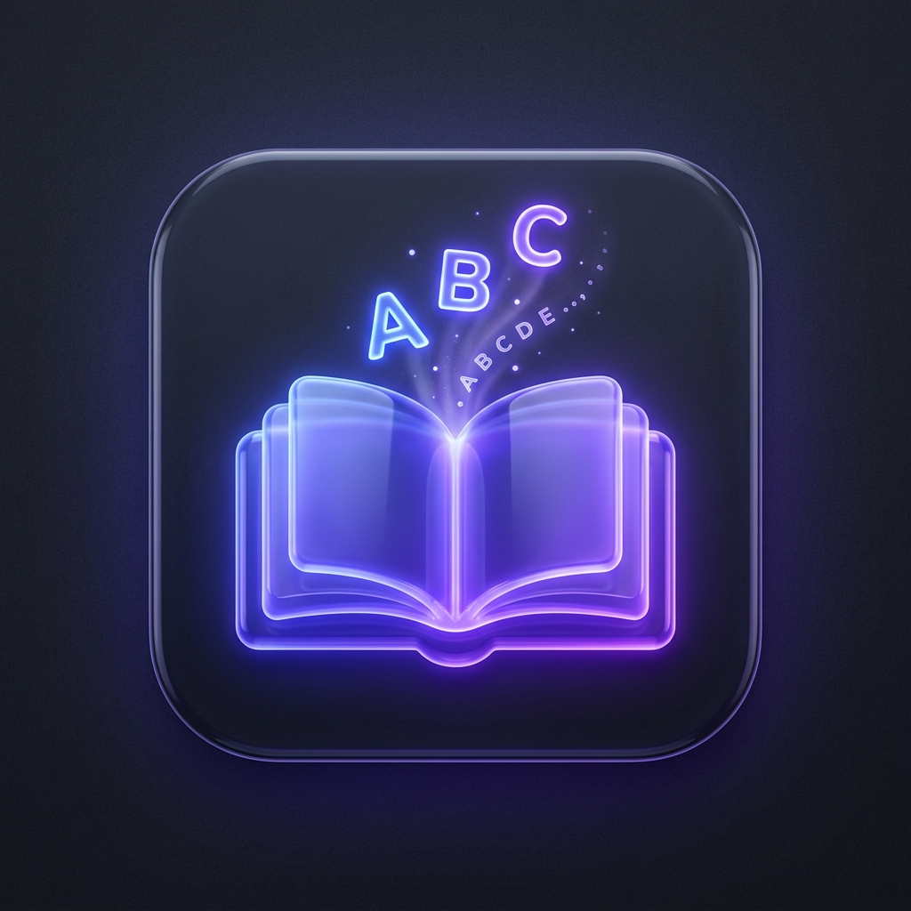

# 📚 VocabMaster - 1000 Từ Vựng Tiếng Anh Theo Chủ Đề

> Ứng dụng web học 1000 từ vựng tiếng Anh theo 50 chủ đề thông dụng nhất với Flashcard 3D, Trắc nghiệm, Luyện nghe, Gõ chính tả và Trò chơi nối từ.



## 🌐 Trải Nghiệm Trực Tiếp (Live Demo)
👉 **[Học Ngay Trên GitHub Pages](https://anhkhoachongiuthuytien.github.io/vocab-master/)**

---

## 🌟 Tính Năng Nổi Bật

- **Giao Diện Trắng Sáng Cao Cấp (eBay & Quizlet Style)**: Nền trắng tinh khôi tương phản tự nhiên, thanh lịch, dễ đọc, không màu mè giả tạo.
- **Hệ Thống Vector SVG Chuyên Nghiệp**: 100% biểu tượng nét mảnh độc quyền (`icons.js`), không dùng emoji.
- **50 Chủ Đề - 1046 Từ Vựng Thực Tế**: Phân loại theo các nhóm chủ đề đời sống, ẩm thực, tâm lý, thiên nhiên, thời trang, nghề nghiệp, sức khỏe, giáo dục...
- **Widget Thẻ Tương Tác Trực Tiếp (Hero Card)**: Lật thẻ, nghe phát âm và đổi từ ngẫu nhiên ngay tại trang chủ.
- **Phát Âm Bản Xứ (Web Speech API)**: Tùy chỉnh giọng Anh - Mỹ, Anh - Anh và tốc độ đọc linh hoạt (0.5x - 1.3x).
- **Thẻ Ghi Nhớ 3D (Flashcards)**: Lật thẻ mượt mà, hỗ trợ phím tắt (`Space` để lật, `← / →` để chuyển thẻ), đánh dấu "Đã thuộc" hoặc "Cần ôn lại".
- **Trắc Nghiệm Tương Tác (Quiz)**: 4 lựa chọn với hệ thống tính điểm, chuỗi combo liên tiếp và âm thanh phản hồi trực quan.
- **Luyện Nghe (Listening Challenge)**: Phát âm từ vựng và chọn đáp án chính xác để cải thiện khả năng nghe nhận diện.
- **Gõ Chính Tả (Dictation)**: Luyện gõ từ vựng tiếng Anh theo nghĩa và gợi ý chữ cái.
- **Trò Chơi Ghép Từ (Word Match Game)**: Nối nhanh các cặp thẻ từ vựng và nghĩa tiếng Việt với đồng hồ tính giờ và lượt bấm.
- **Bảng Tra Cứu Toàn Diện (Word Explorer)**: Xem danh sách từ có sẵn kèm nút nghe phát âm và đánh dấu nhanh.
- **Sổ Tay Từ Khó (Starred Notebook)**: Lưu lại các từ vựng bạn hay quên để ôn tập chuyên sâu.
- **Đồng Bộ & Sao Lưu Đa Thiết Bị (Backup & Sync)**: Xuất/nhập file JSON hoặc mã đồng bộ để chuyển tiến trình giữa điện thoại và máy tính dễ dàng.
- **Chế Độ Giao Diện Sáng / Tối**: Tùy chỉnh Light/Dark theme theo sở thích.

---

## 🛠️ Công Nghệ Sử Dụng

- **Frontend**: HTML5, Vanilla CSS3 (Custom Design System, CSS Variables, 3D Transforms, Glassmorphism), Modern JavaScript (ES6+).
- **Web APIs**: Web Speech API (Phát âm bản xứ), Web Audio API (Hiệu ứng âm thanh sinh động), Canvas API (Hiệu ứng pháo hoa Confetti).
- **Deployment**: GitHub Pages & GitHub Actions.

---

## 🚀 Hướng Dẫn Cài Đặt & Chạy Cục Bộ

1. Clone repository:
   ```bash
   git clone https://github.com/anhkhoachongiuthuytien/vocab-master.git
   cd vocab-master
   ```

2. Mở file `index.html` trực tiếp trên trình duyệt hoặc sử dụng bất kỳ HTTP server tĩnh nào:
   ```bash
   python -m http.server 5173
   # Hoặc dùng npx serve
   npx serve .
   ```

---

## 📄 Bản Quyền & Tài Liệu Nguồn
Dữ liệu từ vựng được trích xuất và chuẩn hóa từ tài liệu *1000 Từ Vựng Tiếng Anh Theo Chủ Đề Thông Dụng*.
